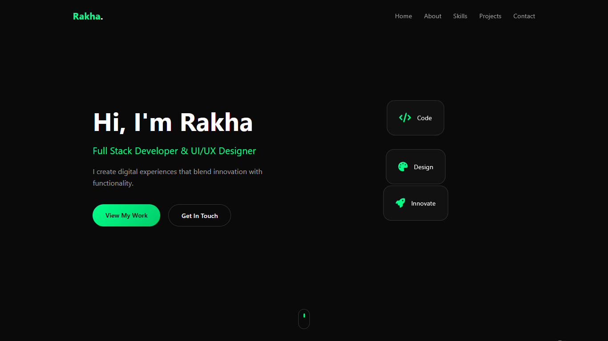
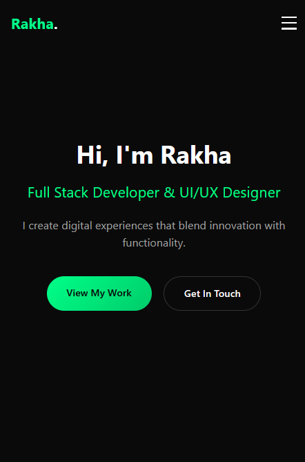

# 🚀 Rakha Tech – Personal Portfolio

A sleek, fully-responsive portfolio website built from scratch with **vanilla HTML, CSS & JavaScript**.  
Showcase your work, skills and contact info in a modern dark-themed interface that works everywhere.

---

## ✨ Live Demo

[https://rakha.vercel.app](https://rakha.vercel.app)

---

## 📸 Screenshots

| Desktop                               | Mobile                              |
| ------------------------------------- | ----------------------------------- |
|  |  |

---

## 🧩 Features

- **Dark Mode First** – modern, elegant and easy on the eyes
- **100 % Responsive** – looks great on phones, tablets and desktops
- **Custom Cursor** – smooth cursor & follower for desktop users
- **Scroll Animations** – sections fade-in when entering the viewport
- **Floating Cards** – subtle floating animation in the hero
- **Mobile Hamburger Menu** – collapsible navigation for small screens
- **Contact Form** – ready-to-hook backend form (currently logs to console)
- **SEO Friendly** – semantic HTML, meta tags, fast load times

---

## 🛠️ Tech Stack

| Front-End  | Tools & Libraries |
| ---------- | ----------------- |
| HTML5      | Font Awesome 6    |
| CSS3       | Google Fonts      |
| Vanilla JS | Git & GitHub      |

---

## 📁 Project Structure

rakha-tech/
├── index.html # Main page
├── style.css # All styles (responsive, dark theme)
├── script.js # Interactions & animations
├── /img # Images, screenshots & favicons
└── README.md # This file
